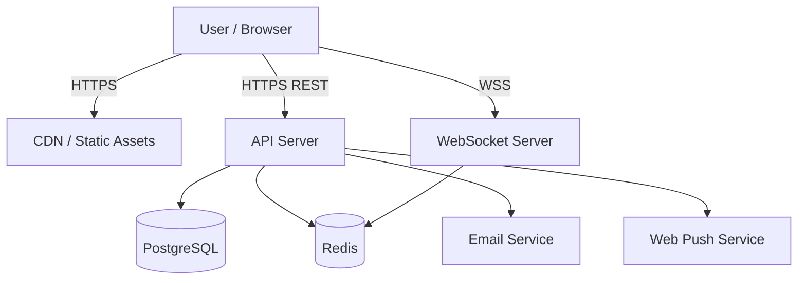
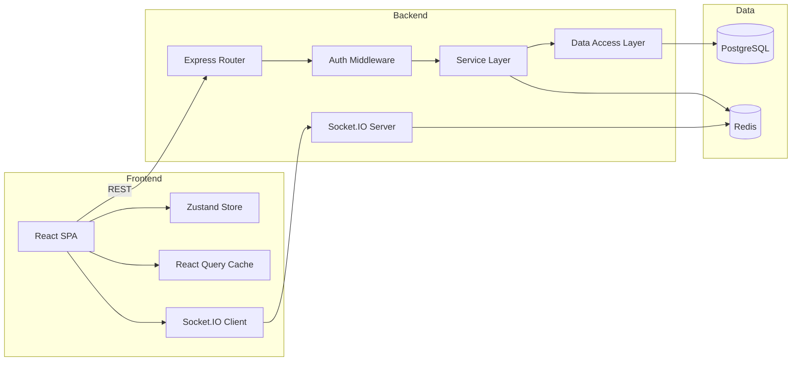
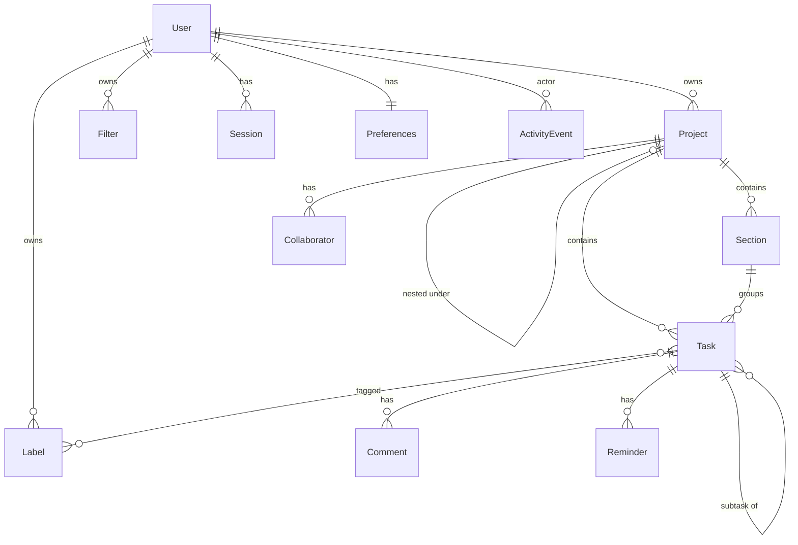

# Design Document: Todoist Web Clone

## Overview

This document describes the technical design for a full-featured Todoist web clone. The system is a real-time collaborative task management application with natural-language date parsing, a filter query language, recurring tasks, and offline-capable optimistic UI. A gamification layer is intentionally deferred and will be designed separately.

The architecture follows a client-server model: a React SPA communicates with a Node.js/Express API server backed by PostgreSQL and Redis. Real-time sync uses WebSockets. The system is designed for horizontal scalability at the API layer and eventual consistency for real-time features.

### Key Design Decisions

| Decision           | Choice                                | Rationale                                                      |
|--------------------|---------------------------------------|----------------------------------------------------------------|
| Frontend framework | React + TypeScript                    | Component model fits complex UI; large ecosystem               |
| State management   | Zustand + React Query                 | Lightweight, supports optimistic updates natively              |
| Backend runtime    | Node.js + Express                     | Same language as frontend; async I/O for WebSocket handling    |
| Database           | PostgreSQL                            | ACID transactions for task ordering; JSONB for flexible fields |
| Cache / sessions   | Redis                                 | Fast session lookup; pub/sub for real-time fan-out             |
| Real-time          | WebSocket (Socket.IO)                 | Bi-directional; auto-reconnect; room-based fan-out             |
| Search             | PostgreSQL full-text search (pg_trgm) | Avoids external dependency; sufficient for substring matching  |
| Date parsing       | Custom PEG grammar (pegjs/peggy)      | Deterministic; testable round-trip; no external API calls      |
| Filter parsing     | Custom PEG grammar (pegjs/peggy)      | Same tooling as date parser; supports operator precedence      |
| Auth               | JWT (access) + opaque refresh token   | Stateless verification; revocable sessions via Redis blacklist |
| Password hashing   | bcrypt (cost 12)                      | Requirement-specified; well-audited library                    |

## Architecture

### System Context Diagram



### High-Level Architecture



### Request Flow

1. Browser sends REST request with JWT in `Authorization` header
2. Express middleware validates JWT, attaches `userId` to request context
3. Router dispatches to appropriate service
4. Service executes business logic, calls DAL for persistence
5. DAL executes SQL within a transaction where needed
6. Service publishes change event to Redis pub/sub
7. WebSocket server receives pub/sub message, fans out to relevant connected clients
8. Client receives event, updates local store (or confirms optimistic update)

## Components and Interfaces

### Frontend Components

| Component          | Responsibility                                               |
|--------------------|--------------------------------------------------------------|
| `AppShell`         | Layout: sidebar, main content, responsive breakpoints        |
| `Sidebar`          | Project tree, navigation, labels, filters                    |
| `TaskList`         | Renders task items with drag-and-drop ordering               |
| `TaskItem`         | Single task row: checkbox, title, due date, priority, labels |
| `TaskDetail`       | Full task editor: all fields, subtasks, comments             |
| `QuickAdd`         | Modal dialog for rapid task creation with NLP date parsing   |
| `DateInput`        | Natural-language date input with preview                     |
| `FilterBar`        | Filter query input with syntax highlighting                  |
| `SearchOverlay`    | Global search with grouped results                           |
| `PreferencesPanel` | User settings: timezone, theme, week start                   |
| `ShortcutHandler`  | Global keyboard shortcut listener                            |
| `SyncManager`      | WebSocket connection, reconnection, queue replay             |
| `OfflineBanner`    | Network status indicator                                     |

### Backend Services

| Service             | Endpoints                                                                                                              | Responsibility                                          |
|---------------------|------------------------------------------------------------------------------------------------------------------------|---------------------------------------------------------|
| `AuthService`       | POST /auth/register, POST /auth/login, POST /auth/logout, POST /auth/reset-password, POST /auth/reset-password/confirm | Registration, login, session management, password reset |
| `TaskService`       | CRUD /tasks, POST /tasks/:id/complete, POST /tasks/:id/reopen, PATCH /tasks/:id/reorder                                | Task lifecycle, ordering, subtask management            |
| `ProjectService`    | CRUD /projects, POST /projects/:id/archive, POST /projects/:id/share, CRUD /projects/:id/sections                      | Project and section management                          |
| `LabelService`      | CRUD /labels                                                                                                           | Label CRUD and task association                         |
| `FilterService`     | CRUD /filters, GET /filters/:id/results                                                                                | Filter CRUD and query evaluation                        |
| `SearchService`     | GET /search?q=                                                                                                         | Full-text search across entities                        |
| `ReminderService`   | CRUD /reminders                                                                                                        | Reminder scheduling and delivery                        |
| `CommentService`    | CRUD /tasks/:id/comments                                                                                               | Task comment management                                 |
| `SyncService`       | WebSocket namespace /sync                                                                                              | Real-time event fan-out                                 |
| `ActivityService`   | GET /activity?project_id=                                                                                              | Activity log retrieval                                  |
| `PreferenceService` | GET/PATCH /preferences                                                                                                 | User preference management                              |

### API Design Conventions

- Base URL: `/api/v1`
- Auth: `Authorization: Bearer <jwt>`
- Request/response: JSON
- Errors: `{ error: { code: string, message: string, details?: object[] } }`
- Pagination: cursor-based (`?cursor=<id>&limit=50`)
- Timestamps: ISO 8601 UTC
- IDs: UUIDs (v4)

### Key API Endpoints

```
POST   /api/v1/auth/register          { email, password, displayName }
POST   /api/v1/auth/login             { email, password }
POST   /api/v1/auth/logout            {}
POST   /api/v1/auth/reset-password    { email }
POST   /api/v1/auth/reset-password/confirm { token, newPassword }

GET    /api/v1/tasks                  ?project_id=&section_id=&view=today|upcoming
POST   /api/v1/tasks                  { title, description?, dueDate?, priority?, projectId?, sectionId?, parentTaskId?, labelIds? }
PATCH  /api/v1/tasks/:id              { title?, description?, dueDate?, priority?, projectId?, sectionId?, labelIds? }
DELETE /api/v1/tasks/:id
POST   /api/v1/tasks/:id/complete
POST   /api/v1/tasks/:id/reopen
PATCH  /api/v1/tasks/:id/reorder      { position }

GET    /api/v1/projects
POST   /api/v1/projects               { name, color, parentId? }
PATCH  /api/v1/projects/:id           { name?, color? }
DELETE /api/v1/projects/:id
POST   /api/v1/projects/:id/archive
POST   /api/v1/projects/:id/share     { email }
DELETE /api/v1/projects/:id/collaborators/:userId

GET    /api/v1/projects/:id/sections
POST   /api/v1/projects/:id/sections  { name }
PATCH  /api/v1/sections/:id           { name?, position? }
DELETE /api/v1/sections/:id

GET    /api/v1/labels
POST   /api/v1/labels                 { name, color }
PATCH  /api/v1/labels/:id             { name?, color? }
DELETE /api/v1/labels/:id

GET    /api/v1/filters
POST   /api/v1/filters                { name, query }
PATCH  /api/v1/filters/:id            { name?, query? }
DELETE /api/v1/filters/:id
GET    /api/v1/filters/:id/results

GET    /api/v1/search?q=

GET    /api/v1/tasks/:id/comments
POST   /api/v1/tasks/:id/comments     { body }
PATCH  /api/v1/comments/:id           { body }
DELETE /api/v1/comments/:id

POST   /api/v1/tasks/:id/reminders    { datetime }
DELETE /api/v1/reminders/:id

GET    /api/v1/activity?project_id=&cursor=
GET    /api/v1/preferences
PATCH  /api/v1/preferences            { timeZone?, weekStart?, theme? }
```

## Data Models

### Entity Relationship Diagram



### Core Tables

#### users
| Column        | Type         | Constraints            |
|---------------|--------------|------------------------|
| id            | UUID         | PK                     |
| email         | VARCHAR(255) | UNIQUE, NOT NULL       |
| password_hash | VARCHAR(255) | NOT NULL               |
| display_name  | VARCHAR(50)  | NOT NULL               |
| created_at    | TIMESTAMPTZ  | NOT NULL DEFAULT NOW() |
| updated_at    | TIMESTAMPTZ  | NOT NULL DEFAULT NOW() |

#### preferences
| Column                | Type         | Constraints               |
|-----------------------|--------------|---------------------------|
| user_id               | UUID         | PK, FK → users.id         |
| time_zone             | VARCHAR(100) | NOT NULL DEFAULT 'UTC'    |
| week_start            | VARCHAR(10)  | NOT NULL DEFAULT 'sunday' |
| theme                 | VARCHAR(10)  | NOT NULL DEFAULT 'system' |
| notifications_enabled | BOOLEAN      | NOT NULL DEFAULT true     |

#### sessions
| Column     | Type         | Constraints             |
|------------|--------------|-------------------------|
| id         | UUID         | PK                      |
| user_id    | UUID         | FK → users.id, NOT NULL |
| token_hash | VARCHAR(255) | UNIQUE, NOT NULL        |
| expires_at | TIMESTAMPTZ  | NOT NULL                |
| created_at | TIMESTAMPTZ  | NOT NULL DEFAULT NOW()  |

#### projects
| Column      | Type         | Constraints                |
|-------------|--------------|----------------------------|
| id          | UUID         | PK                         |
| user_id     | UUID         | FK → users.id, NOT NULL    |
| parent_id   | UUID         | FK → projects.id, NULLABLE |
| name        | VARCHAR(120) | NOT NULL                   |
| color       | VARCHAR(20)  | NOT NULL                   |
| is_inbox    | BOOLEAN      | NOT NULL DEFAULT false     |
| is_archived | BOOLEAN      | NOT NULL DEFAULT false     |
| order_value | INTEGER      | NOT NULL DEFAULT 0         |
| created_at  | TIMESTAMPTZ  | NOT NULL DEFAULT NOW()     |
| updated_at  | TIMESTAMPTZ  | NOT NULL DEFAULT NOW()     |

#### collaborators
| Column     | Type        | Constraints                |
|------------|-------------|----------------------------|
| id         | UUID        | PK                         |
| project_id | UUID        | FK → projects.id, NOT NULL |
| user_id    | UUID        | FK → users.id, NOT NULL    |
| created_at | TIMESTAMPTZ | NOT NULL DEFAULT NOW()     |
| UNIQUE     |             | (project_id, user_id)      |

#### sections
| Column      | Type         | Constraints                |
|-------------|--------------|----------------------------|
| id          | UUID         | PK                         |
| project_id  | UUID         | FK → projects.id, NOT NULL |
| name        | VARCHAR(120) | NOT NULL                   |
| order_value | INTEGER      | NOT NULL DEFAULT 0         |
| created_at  | TIMESTAMPTZ  | NOT NULL DEFAULT NOW()     |
| updated_at  | TIMESTAMPTZ  | NOT NULL DEFAULT NOW()     |

#### tasks
| Column           | Type         | Constraints                     |
|------------------|--------------|---------------------------------|
| id               | UUID         | PK                              |
| user_id          | UUID         | FK → users.id, NOT NULL         |
| project_id       | UUID         | FK → projects.id, NOT NULL      |
| section_id       | UUID         | FK → sections.id, NULLABLE      |
| parent_task_id   | UUID         | FK → tasks.id, NULLABLE         |
| assignee_user_id | UUID         | FK → users.id, NULLABLE         |
| title            | VARCHAR(500) | NOT NULL                        |
| description      | TEXT         | NULLABLE                        |
| priority         | SMALLINT     | NOT NULL DEFAULT 4, CHECK (1-4) |
| due_date         | DATE         | NULLABLE                        |
| due_time         | TIMETZ       | NULLABLE                        |
| due_timezone     | VARCHAR(100) | NULLABLE                        |
| recurrence_rule  | JSONB        | NULLABLE                        |
| is_completed     | BOOLEAN      | NOT NULL DEFAULT false          |
| completed_at     | TIMESTAMPTZ  | NULLABLE                        |
| order_value      | INTEGER      | NOT NULL DEFAULT 0              |
| depth            | SMALLINT     | NOT NULL DEFAULT 0, CHECK (0-5) |
| created_at       | TIMESTAMPTZ  | NOT NULL DEFAULT NOW()          |
| updated_at       | TIMESTAMPTZ  | NOT NULL DEFAULT NOW()          |

#### task_labels
| Column      | Type | Constraints              |
|-------------|------|--------------------------|
| task_id     | UUID | FK → tasks.id, NOT NULL  |
| label_id    | UUID | FK → labels.id, NOT NULL |
| PRIMARY KEY |      | (task_id, label_id)      |

#### labels
| Column     | Type        | Constraints             |
|------------|-------------|-------------------------|
| id         | UUID        | PK                      |
| user_id    | UUID        | FK → users.id, NOT NULL |
| name       | VARCHAR(60) | NOT NULL                |
| color      | VARCHAR(20) | NOT NULL                |
| created_at | TIMESTAMPTZ | NOT NULL DEFAULT NOW()  |
| updated_at | TIMESTAMPTZ | NOT NULL DEFAULT NOW()  |
| UNIQUE     |             | (user_id, LOWER(name))  |

#### filters
| Column     | Type         | Constraints             |
|------------|--------------|-------------------------|
| id         | UUID         | PK                      |
| user_id    | UUID         | FK → users.id, NOT NULL |
| name       | VARCHAR(120) | NOT NULL                |
| query      | TEXT         | NOT NULL                |
| created_at | TIMESTAMPTZ  | NOT NULL DEFAULT NOW()  |
| updated_at | TIMESTAMPTZ  | NOT NULL DEFAULT NOW()  |

#### comments
| Column     | Type        | Constraints                      |
|------------|-------------|----------------------------------|
| id         | UUID        | PK                               |
| task_id    | UUID        | FK → tasks.id, NOT NULL          |
| user_id    | UUID        | FK → users.id, NOT NULL          |
| body       | TEXT        | NOT NULL, CHECK (length 1-15000) |
| created_at | TIMESTAMPTZ | NOT NULL DEFAULT NOW()           |
| updated_at | TIMESTAMPTZ | NULLABLE                         |

#### reminders
| Column     | Type        | Constraints             |
|------------|-------------|-------------------------|
| id         | UUID        | PK                      |
| task_id    | UUID        | FK → tasks.id, NOT NULL |
| user_id    | UUID        | FK → users.id, NOT NULL |
| remind_at  | TIMESTAMPTZ | NOT NULL                |
| is_fired   | BOOLEAN     | NOT NULL DEFAULT false  |
| created_at | TIMESTAMPTZ | NOT NULL DEFAULT NOW()  |

#### activity_events
| Column      | Type        | Constraints                |
|-------------|-------------|----------------------------|
| id          | UUID        | PK                         |
| user_id     | UUID        | FK → users.id, NOT NULL    |
| project_id  | UUID        | FK → projects.id, NULLABLE |
| entity_type | VARCHAR(20) | NOT NULL                   |
| entity_id   | UUID        | NOT NULL                   |
| event_type  | VARCHAR(20) | NOT NULL                   |
| before_data | JSONB       | NULLABLE                   |
| after_data  | JSONB       | NULLABLE                   |
| created_at  | TIMESTAMPTZ | NOT NULL DEFAULT NOW()     |

#### password_reset_tokens
| Column     | Type         | Constraints             |
|------------|--------------|-------------------------|
| id         | UUID         | PK                      |
| user_id    | UUID         | FK → users.id, NOT NULL |
| token_hash | VARCHAR(255) | UNIQUE, NOT NULL        |
| expires_at | TIMESTAMPTZ  | NOT NULL                |
| used_at    | TIMESTAMPTZ  | NULLABLE                |
| created_at | TIMESTAMPTZ  | NOT NULL DEFAULT NOW()  |

#### project_invitations
| Column      | Type         | Constraints                |
|-------------|--------------|----------------------------|
| id          | UUID         | PK                         |
| project_id  | UUID         | FK → projects.id, NOT NULL |
| email       | VARCHAR(255) | NOT NULL                   |
| token_hash  | VARCHAR(255) | UNIQUE, NOT NULL           |
| accepted_at | TIMESTAMPTZ  | NULLABLE                   |
| created_at  | TIMESTAMPTZ  | NOT NULL DEFAULT NOW()     |

### Key Indexes

```sql
CREATE INDEX idx_tasks_user_project ON tasks(user_id, project_id) WHERE NOT is_completed;
CREATE INDEX idx_tasks_due_date ON tasks(user_id, due_date) WHERE NOT is_completed AND due_date IS NOT NULL;
CREATE INDEX idx_tasks_parent ON tasks(parent_task_id) WHERE parent_task_id IS NOT NULL;
CREATE INDEX idx_tasks_section ON tasks(section_id) WHERE section_id IS NOT NULL;
CREATE INDEX idx_tasks_search ON tasks USING gin(to_tsvector('english', title || ' ' || COALESCE(description, '')));
CREATE INDEX idx_projects_user ON projects(user_id);
CREATE INDEX idx_collaborators_user ON collaborators(user_id);
CREATE INDEX idx_activity_project ON activity_events(project_id, created_at DESC);
CREATE INDEX idx_reminders_pending ON reminders(remind_at) WHERE NOT is_fired;
CREATE INDEX idx_labels_user ON labels(user_id);
CREATE INDEX idx_sessions_token ON sessions(token_hash);
```

### Recurrence Rule Schema (JSONB)

```json
{
  "type": "daily" | "weekly" | "monthly" | "yearly",
  "interval": 1,
  "weekdays": [1, 3, 5],
  "dayOfMonth": 15,
  "month": 6,
  "dayOfYear": 15
}
```

### Filter Expression AST

```typescript
type FilterExpr =
  | { type: 'and'; left: FilterExpr; right: FilterExpr }
  | { type: 'or'; left: FilterExpr; right: FilterExpr }
  | { type: 'not'; expr: FilterExpr }
  | { type: 'project'; name: string }
  | { type: 'label'; name: string }
  | { type: 'priority'; level: 1 | 2 | 3 | 4 }
  | { type: 'today' }
  | { type: 'overdue' }
  | { type: 'noDate' }
  | { type: 'dueOn'; date: string }
  | { type: 'dueBefore'; date: string }
  | { type: 'dueAfter'; date: string }
  | { type: 'assignedTo'; user: string | 'me' }
  | { type: 'text'; value: string };
```

### Due Date Structure

```typescript
interface DueDate {
  date: string;          // YYYY-MM-DD
  time?: string;         // HH:MM (24h)
  timezone?: string;     // IANA timezone
  recurrence?: RecurrenceRule;
}

interface RecurrenceRule {
  type: 'daily' | 'weekly' | 'monthly' | 'yearly';
  interval: number;      // 1-999
  weekdays?: number[];   // 0=Sun, 1=Mon, ..., 6=Sat
  dayOfMonth?: number;   // 1-31
  month?: number;        // 1-12
}
```


## Correctness Properties

*A property is a characteristic or behavior that should hold true across all valid executions of a system — essentially, a formal statement about what the system should do. Properties serve as the bridge between human-readable specifications and machine-verifiable correctness guarantees.*

### Property 1: Date parser round-trip

*For any* structured DueDate value `d` produced by the Date_Parser, printing `d` with Date_Printer and then parsing the result with Date_Parser SHALL produce a DueDate equivalent to `d`.

**Validates: Requirements 13.8, 13.9**

### Property 2: Filter parser round-trip

*For any* structured FilterExpr `e` produced by the Filter_Parser, printing `e` with Filter_Printer and then parsing the result with Filter_Parser SHALL produce a FilterExpr equal to `e`.

**Validates: Requirements 16.6, 16.7**

### Property 3: Recurrence sequence strict monotonicity

*For any* RecurrenceRule `r` and starting date `s`, the sequence of dates produced by repeatedly applying the Recurrence_Engine starting from `s` SHALL be strictly monotonically increasing (each date strictly after the previous).

**Validates: Requirements 14.2, 14.9**

### Property 4: Recurrence weekday correctness

*For any* RecurrenceRule of type "every <weekday>" and any starting date, the next computed date SHALL fall on the specified weekday and SHALL be strictly after the starting date.

**Validates: Requirements 14.4**

### Property 5: Recurrence N-day arithmetic

*For any* RecurrenceRule of type "every N days" where N is 1-999, and any starting date, the next computed date SHALL equal the starting date plus exactly N calendar days.

**Validates: Requirements 14.5**

### Property 6: Recurrence time preservation

*For any* recurring task with a time component in its DueDate, when the Recurrence_Engine computes the next occurrence, the time component SHALL be identical to the original.

**Validates: Requirements 14.6**

### Property 7: Recurrence month-end clamping

*For any* monthly RecurrenceRule targeting day D where D exceeds the number of days in the target month, the Recurrence_Engine SHALL use the last day of that month.

**Validates: Requirements 14.7**

### Property 8: Task title validation

*For any* string of length 1 to 500 characters, task creation SHALL succeed. *For any* string of length 0 or greater than 500 characters, task creation SHALL be rejected with a title-length error.

**Validates: Requirements 4.1, 4.2, 5.1**

### Property 9: Task priority validation

*For any* integer in the range 1 to 4, setting it as a task's priority SHALL succeed and store that value. *For any* integer outside the range 1 to 4, the request SHALL be rejected with a priority-invalid error.

**Validates: Requirements 4.6, 4.7**

### Property 10: Subtask depth enforcement

*For any* task hierarchy, creating or moving a subtask such that its depth would exceed 5 levels below the top-level task SHALL be rejected. Creating or moving a subtask to depth 5 or less SHALL succeed.

**Validates: Requirements 8.2, 8.3**

### Property 11: Subtask cycle detection

*For any* task update that would set a task's parent_task_id to itself or to any of its descendants, the Task_Service SHALL reject the request with a cyclic-reference error.

**Validates: Requirements 8.4**

### Property 12: Parent completion cascades to all descendants

*For any* task tree, when the root task is marked complete, all descendant subtasks SHALL also be marked complete (is_completed = true, completed_at set).

**Validates: Requirements 6.4**

### Property 13: Parent deletion cascades to all descendants

*For any* task tree, when the root task is deleted, all descendant subtasks SHALL also be deleted.

**Validates: Requirements 7.1, 8.6**

### Property 14: Moving parent moves all descendants

*For any* task tree, when the root task is moved to a different project, all descendant subtasks SHALL be moved to the same project with their section_ids cleared.

**Validates: Requirements 8.5**

### Property 15: Task ordering invariant

*For any* set of tasks within a project or section, after a reorder operation placing a task at position P, querying the task list SHALL return tasks in ascending order_value with the moved task at position P and all other tasks maintaining their relative order.

**Validates: Requirements 9.2, 9.3**

### Property 16: Project name and color validation

*For any* project name of 1 to 120 characters that does not duplicate an existing project name for the same user, and a color from the supported palette, project creation SHALL succeed. *For any* name that is empty, exceeds 120 characters, or duplicates an existing name, creation SHALL be rejected.

**Validates: Requirements 10.1, 10.2, 10.3**

### Property 17: Archived project exclusion from views

*For any* task belonging to an archived project, that task SHALL NOT appear in Today_View, Upcoming_View, or Filter evaluation results.

**Validates: Requirements 10.5**

### Property 18: Project nesting depth enforcement

*For any* project hierarchy, creating or moving a project such that its depth would exceed 4 levels SHALL be rejected.

**Validates: Requirements 10.9**

### Property 19: Label name validation

*For any* string of 1 to 60 characters containing only alphanumeric characters and underscores, and not matching (case-insensitive) an existing label name for the same user, label creation SHALL succeed. *For any* string that is empty, exceeds 60 characters, contains invalid characters, or duplicates an existing name, creation SHALL be rejected.

**Validates: Requirements 12.1, 12.2, 12.3**

### Property 20: Today view correctness

*For any* set of tasks owned by or shared with a user, the Today_View SHALL return exactly the incomplete tasks whose due_date is on or before the user's current local date, excluding tasks in archived projects, ordered by priority ascending then order_value ascending.

**Validates: Requirements 15.2, 15.5, 15.6**

### Property 21: Upcoming view correctness

*For any* integer N in 7-30 and any set of tasks, the Upcoming_View SHALL return exactly the incomplete tasks whose due_date falls within the next N days from the user's current local date, excluding archived projects, grouped by day and ordered by priority ascending then order_value ascending within each group.

**Validates: Requirements 15.3, 15.4, 15.5**

### Property 22: Filter evaluation correctness

*For any* valid FilterExpr and any set of tasks owned by or shared with the user, evaluating the filter SHALL return exactly the tasks that satisfy the boolean expression (with correct semantics for each operand type).

**Validates: Requirements 16.8**

### Property 23: Search correctness

*For any* query string of 2-200 characters and any set of entities, the Search_Service SHALL return all entities whose title, name, or description contains the query as a case-insensitive substring, grouped by type (Tasks, Projects, Labels), capped at 50 per type, ordered by most recently updated first.

**Validates: Requirements 17.1, 17.2, 17.3**

### Property 26: Authorization enforcement

*For any* entity (task, project, section, label, filter, comment) not owned by and not in a project shared with the requesting user, any read, update, or delete request SHALL be rejected with a not-accessible error.

**Validates: Requirements 26.3, 5.5**

### Property 27: Optimistic update revert on API failure

*For any* task mutation that is optimistically applied to the UI, if the API server returns an error, the Web_Client SHALL revert the UI to the exact pre-mutation state within 2000 milliseconds.

**Validates: Requirements 28.2, 28.3**

### Property 28: Section deletion moves tasks to project

*For any* section containing tasks, when the section is deleted, all tasks previously in that section SHALL have their section_id set to null and remain in the same project.

**Validates: Requirements 11.3**

## Error Handling

### API Error Response Format

```json
{
  "error": {
    "code": "VALIDATION_ERROR",
    "message": "Human-readable description",
    "details": [
      { "field": "title", "code": "TITLE_TOO_LONG", "message": "Title must be 1-500 characters" }
    ]
  }
}
```

### Error Code Categories

| HTTP Status | Error Code Pattern             | Usage                                                  |
|-------------|--------------------------------|--------------------------------------------------------|
| 400         | VALIDATION_*                   | Input validation failures (multiple errors aggregated) |
| 401         | AUTH_REQUIRED, SESSION_EXPIRED | Missing or expired token                               |
| 403         | ACCESS_DENIED                  | Valid auth but insufficient permissions                |
| 404         | NOT_FOUND                      | Entity doesn't exist or not accessible to user         |
| 409         | CONFLICT_*                     | Duplicate email, duplicate label name, etc.            |
| 422         | PARSE_ERROR                    | Date or filter query parse failure                     |
| 429         | RATE_LIMITED                   | Too many failed login attempts                         |
| 500         | INTERNAL_ERROR                 | Unexpected server errors                               |

### Error Handling Strategy

- **Validation errors**: Aggregate all field-level errors into a single response (Req 1.5, 4.10)
- **Authorization errors**: Return 404 (not 403) for entities that don't exist or aren't accessible to avoid information leakage (Req 5.5)
- **Login errors**: Use identical error messages for wrong email vs wrong password (Req 2.2, 2.3)
- **Parse errors**: Include position of first unexpected token for filter queries (Req 16.3), include unrecognized substring for date parsing (Req 13.7)
- **Optimistic update failures**: Client reverts UI state and shows toast notification (Req 28.3)
- **WebSocket disconnection**: Queue edits locally, replay on reconnection (Req 21.3, 27.6, 27.7)
- **Rate limiting**: Return 429 with `Retry-After` header indicating seconds until retry is allowed

### Retry and Resilience

- API calls: Exponential backoff with jitter, max 3 retries for 5xx errors
- WebSocket: Auto-reconnect with exponential backoff (1s, 2s, 4s, 8s, max 30s)
- Offline queue: Persist to IndexedDB, replay in order on reconnection
- Reminder delivery: Retry up to 3 times with 10s intervals if push fails

## Testing Strategy

### Property-Based Testing

**Library**: [fast-check](https://github.com/dubzzz/fast-check) (TypeScript)

**Configuration**: Minimum 100 iterations per property test.

**Tag format**: `Feature: todoist-web-clone, Property {number}: {title}`

Properties to implement as PBT:

| Property                       | Target Component              | Generator Strategy                                |
|--------------------------------|-------------------------------|---------------------------------------------------|
| 1: Date parser round-trip      | Date_Parser, Date_Printer     | Generate random valid DueDate structures          |
| 2: Filter parser round-trip    | Filter_Parser, Filter_Printer | Generate random valid FilterExpr ASTs             |
| 3-7: Recurrence properties     | Recurrence_Engine             | Generate random RecurrenceRules and start dates   |
| 8-9: Task field validation     | Task_Service validators       | Generate random strings/integers at boundaries    |
| 10-14: Subtask tree properties | Task_Service                  | Generate random task trees of varying depth       |
| 15: Task ordering              | Task_Service reorder logic    | Generate random task lists and reorder operations |
| 16: Project validation         | Project_Service validators    | Generate random names and colors                  |
| 17: Archived exclusion         | View query logic              | Generate task sets with mixed archive states      |
| 18: Project nesting            | Project_Service               | Generate project hierarchies                      |
| 19: Label validation           | Label_Service validators      | Generate random label names                       |
| 20-21: View correctness        | View query logic              | Generate task sets with various dates/priorities  |
| 22: Filter evaluation          | Filter_Service evaluator      | Generate FilterExprs and task sets                |
| 23: Search correctness         | Search_Service                | Generate entity sets and query strings            |
| 26: Authorization              | Auth middleware               | Generate entity access attempts                   |
| 27: Optimistic revert          | Frontend store                | Generate mutations and simulate failures          |
| 28: Section deletion           | Project_Service               | Generate sections with tasks                      |

### Unit Tests (Example-Based)

Focus areas:
- Specific edge cases not covered by generators (empty strings, boundary values)
- Authentication flows (login, logout, rate limiting)
- Specific keyboard shortcut bindings
- Preference updates (small enum domains)
- Comment CRUD authorization rules

### Integration Tests

Focus areas:
- Full request lifecycle (HTTP → service → DB → response)
- WebSocket event delivery timing
- Reminder scheduling and delivery
- Collaboration invitation flow
- Activity log event creation
- Cascade operations (project delete → sections → tasks)

### End-to-End Tests

- Registration → login → create project → create task → complete task
- Share project → accept invitation → assign task → verify sync
- Offline edit → reconnect → verify sync
- Filter creation → evaluation → verify results

### Performance Tests

- Today view render with 200 tasks < 1000ms
- Optimistic update reflection < 100ms
- API response times under load (p95 < 500ms)
