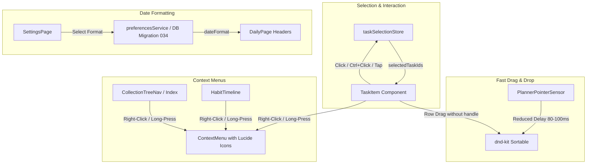

# Implementation Plan - Task Interactions, Context Menus, Fast Dragging & Date Format Preference

Improve user interaction behavior on desktop and mobile for clicking, multi-selecting, right-clicking, long-pressing, context menus with icons, faster dragging without dedicated drag icon handles, collection context menus, and custom Daily date formats.

## Architecture & Design Overview

## User Review Required

> [!IMPORTANT]
> **Key UX Behavioral Alignment**:
> 1. **Desktop Click Selection**: Single click on a task row now selects that task (highlighted visually). Pressing `Ctrl` + click toggles multi-selection across tasks.
> 2. **Mobile Touch Selection**: Single tap on a task row selects it and enters multi-select mode, where subsequent taps add/remove tasks from selection.
> 3. **Drag Handle Removal**: The `⠿` drag icon on the left of `TaskItem` is removed. Touch and mouse dragging are now initiated smoothly on the task row with reduced press delay (80–100ms), giving more breathing room for bullet journal priorities.
> 4. **Collections Chevron Removal**: The `>` chevron icons on collection rows in `CollectionsIndexPage` are removed, replaced by long-press/right-click context menus with icons matching image 0.
> 5. **Daily Date Display Formats**: New setting in Preferences allows choosing formats like `AUG 05 WED`, `05/08 QUA`, `05-08-2026 WED`, `WED AUG 05`, `2026-08-05`.

## Proposed Changes

### Database & Backend

#### [NEW] `api/src/db/migrations/034_preferences_date_format.sql`
- Add `date_format` column to `preferences` table defaulting to `'MMM DD ddd'`.

#### [MODIFY] `api/src/services/preferencesService.ts`
- Add `dateFormat` to `PreferencesRow`, `UpdatePreferencesInput`, and validation schema (`VALID_DATE_FORMATS`).

---

### Frontend State & Core Components

#### [NEW] `app/src/stores/taskSelectionStore.ts`
- Create Zustand store for `selectedTaskIds: Set<string>`.
- Actions: `selectTask(id, isMulti)`, `toggleTask(id)`, `clearSelection()`, `isSelected(id)`.

#### [MODIFY] `app/src/components/TaskItem.tsx`
- Remove `.task-item-drag-handle` (`⠿`) element.
- Add `isSelected` prop and styling (`task-item--selected`).
- Handle click (single click select, Ctrl/Cmd+click multi-select, mobile tap select).
- Handle touch long-press for context menu.

#### [MODIFY] `app/src/components/dnd/sensors.ts`
- Update `PlannerPointerSensor` to support whole-row dragging on touch/pointer without requiring `DRAG_HANDLE_ATTR`.
- Reduce `PRESS_ACTIVATION` delay to 80–100ms for faster, smoother drag response.

#### [MODIFY] `app/src/components/ui/ContextMenu.tsx`
- Ensure all context menu items accept and render Lucide icons seamlessly.

---

### Pages & View Components

#### [MODIFY] `app/src/pages/DailyPage.tsx`
- Update section headers to format dates according to user preference (`prefs?.dateFormat`).
- Add Lucide icons to all context menu items (Date, Priority, Project, Add above, Add below, Delete).
- Integrate `taskSelectionStore` for multi-selection.

#### [MODIFY] `app/src/pages/InboxPage.tsx` & `app/src/pages/CollectionsPage.tsx`
- Add Lucide icons to task context menus.
- Support task selection & multi-selection.

#### [MODIFY] `app/src/components/habits/HabitTimeline.tsx`
- Add right-click and long-press context menu to habit rows and group headers with icons (Rename, Icon toggle, Sub-habit, Delete).

#### [MODIFY] `app/src/components/CollectionTreeNav.tsx` & `app/src/pages/CollectionsIndexPage.tsx`
- Remove `>` chevron icon from collection rows.
- Add context menu (Rename, Add sub-collection, Delete) with icons matching image 0 on right-click / long-press / actions menu.

#### [MODIFY] `app/src/pages/SettingsPage.tsx`
- Add "Date Display Format" radio selection setting under General preferences with live previews of Bullet Journal formats.

---

### Tests

#### [NEW] `app/src/stores/__tests__/taskSelectionStore.test.ts`
- Test selection toggling, single select, Ctrl multi-select, clear selection.

#### [MODIFY] `app/src/components/__tests__/TaskItem.test.tsx` & `TaskItem.interaction.test.tsx`
- Test desktop click selection, Ctrl+click multi-select, touch selection, right-click context menu.

#### [NEW] `app/src/components/__tests__/ContextMenu.icons.test.tsx`
- Test context menu item rendering with icons for tasks, habits, and collections.

#### [MODIFY] `api/src/__tests__/preferencesService.test.ts`
- Test `dateFormat` validation and persistence.

## Verification Plan

### Automated Tests
- Run API tests: `docker compose exec api npm test`
- Run App tests: `docker compose exec app npm test`
- Run single targeted vitest runs for new selection and context menu test files.

### Manual Verification
- Visual inspection on `https://antigravity.planner.local`:
  - Single click tasks on desktop to verify selection highlight.
  - Hold Ctrl and click multiple tasks to verify multi-selection.
  - Drag tasks on desktop and touch emulator to verify speed and smoothness without drag handle.
  - Right-click task, habit, and collection to verify context menus with icons.
  - Change date format in Settings and verify Daily page header update.
