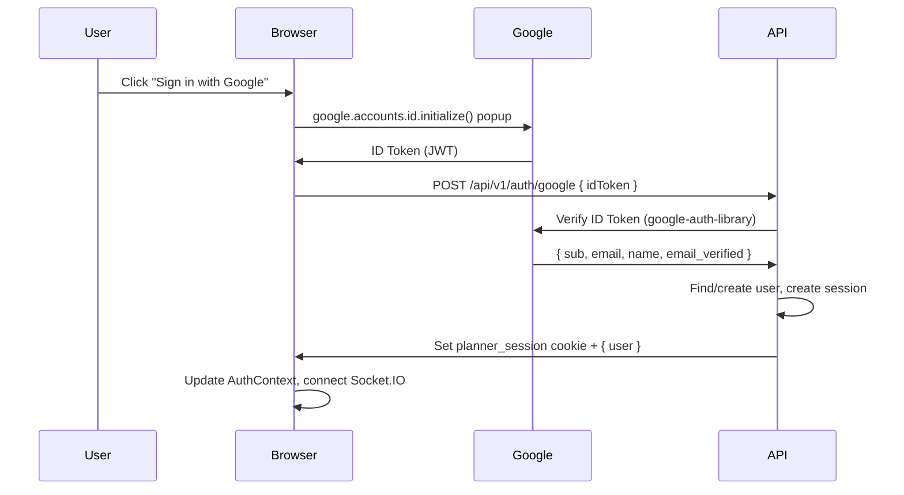

# Login with Google — Plan

## Context

Planner currently supports email/password authentication only, using Argon2id password hashing and opaque server-side sessions stored in PostgreSQL (migrated from JWTs in migration `027`). We want to add **"Sign in with Google"** as an alternative authentication method.

### Current Auth Architecture (reference)

| Layer | Implementation |
|-------|---------------|
| Password hashing | Argon2id (`argon2` package) |
| Sessions | Opaque tokens, SHA-256 hashed, stored in `sessions` table |
| Cookie | `planner_session` (HttpOnly, Secure, SameSite=Lax) |
| Rate limiting | Redis-backed, 10 attempts / 15 min |
| Frontend state | React Context (`AuthContext.tsx`), no Zustand store for auth |

Key files:
- [`authService.ts`](file:///p/projects/planner/api/src/services/authService.ts) — register/login logic
- [`sessionService.ts`](file:///p/projects/planner/api/src/services/sessionService.ts) — opaque token creation/validation
- [`auth.ts` (middleware)](file:///p/projects/planner/api/src/middleware/auth.ts) — cookie extraction + session check
- [`auth.ts` (routes)](file:///p/projects/planner/api/src/routes/auth.ts) — 6 endpoints
- [`AuthContext.tsx`](file:///p/projects/planner/app/src/contexts/AuthContext.tsx) — frontend auth state
- [`LoginPage.tsx`](file:///p/projects/planner/app/src/pages/LoginPage.tsx) / [`RegisterPage.tsx`](file:///p/projects/planner/app/src/pages/RegisterPage.tsx)

### Current DB Constraints

**Critical**: `password_hash VARCHAR(255) NOT NULL` — must become nullable for OAuth-only accounts.

---

## Approach: Google Identity Services (GIS) + Server-Side Verification

We'll use Google's recommended modern flow:



**Why this approach over Passport.js?**
- Fewer dependencies (just `google-auth-library` vs `passport` + `passport-google-oauth20` + `express-session`)
- No server-side redirect flow needed (popup-based)
- No Google access/refresh tokens stored (we only verify the ID token and discard it)
- Simpler integration with our existing opaque session system

---

## GDPR / LGPD Compliance

### Data We Receive from Google

| Field | Stored? | Purpose |
|-------|---------|---------|
| `sub` (Google user ID) | ✅ As `google_id` | Account linking |
| `email` | ✅ In `users.email` | Account identification |
| `name` / `given_name` | ✅ As `display_name` | Display name (first-time only) |
| `picture` | ❌ Not stored | Not needed |
| `email_verified` | ❌ Checked, not stored | Verification gate |
| ID Token | ❌ Verified and discarded | Authentication |

### Compliance Analysis

#### 1. Legal Basis for Processing
- **GDPR Art. 6(1)(b)** / **LGPD Art. 7(V)**: Processing necessary for performance of contract (providing the Planner service). Login is a contractual necessity — no separate consent checkbox needed.
- The privacy policy must explain the Google OAuth data processing.

#### 2. Data Minimization (GDPR Art. 5(1)(c) / LGPD Art. 6(III))
- We store only `google_id`, `email`, and `display_name` — the minimum needed for account operation.
- No Google access tokens, refresh tokens, or profile pictures are stored.
- ID token is verified server-side and immediately discarded.

#### 3. Right to Deletion (GDPR Art. 17 / LGPD Art. 18(VI))
- Account deletion must remove the `google_id` column value.
- Already handled by `ON DELETE CASCADE` on user-related tables.
- If a dedicated `oauth_accounts` table is used, it must also cascade.

#### 4. Privacy Policy Requirements
- [ ] Disclose Google as a third-party authentication provider
- [ ] List exactly what data is received (`email`, `name`, `Google user ID`)
- [ ] Explain that no Google tokens are stored
- [ ] Explain that Google's OAuth terms apply
- [ ] Provide DPO / contact information for data inquiries

#### 5. Cookie Impact
- Session cookie (`planner_session`) is "strictly necessary" — no consent banner impact.
- No additional cookies are introduced by server-side ID token verification.
- The Google Identity Services JavaScript library may set its own cookies — these are covered under Google's privacy policy.

#### 6. Data Processing Agreement
- Google's OAuth/API Terms of Service serve as the DPA for ID token verification.
- No additional agreement needed since we don't store Google tokens or access Google APIs beyond verification.

---

## Backend

### Migration `037_google_oauth.sql`

```sql
-- Make password_hash nullable for OAuth-only accounts
ALTER TABLE users ALTER COLUMN password_hash DROP NOT NULL;

-- Add Google ID column for account linking
ALTER TABLE users ADD COLUMN google_id VARCHAR(255) UNIQUE;
CREATE INDEX idx_users_google_id ON users (google_id) WHERE google_id IS NOT NULL;
```

> [!NOTE]
> We use a column on the `users` table rather than a separate `oauth_accounts` table because we only support one OAuth provider (Google). If more providers are added in the future, we can migrate to a separate table.

### New Dependency

```bash
npm install google-auth-library
```

### Auth Service Changes (`authService.ts`)

New function:

```typescript
async function loginWithGoogle(idToken: string): Promise<{ user: UserData; rawToken: string }> {
  // 1. Verify ID token
  const client = new OAuth2Client(process.env.GOOGLE_CLIENT_ID);
  const ticket = await client.verifyIdToken({
    idToken,
    audience: process.env.GOOGLE_CLIENT_ID,
  });
  const payload = ticket.getPayload();
  if (!payload || !payload.email_verified) {
    throw new AppError('INVALID_GOOGLE_TOKEN', 'Google token verification failed', 401);
  }

  const { sub: googleId, email, name } = payload;

  // 2. Find existing user by google_id
  let user = await findUserByGoogleId(googleId);

  if (!user) {
    // 3. Check if user exists by email (link accounts)
    user = await findUserByEmail(email);
    if (user) {
      // Link Google to existing account
      await linkGoogleAccount(user.id, googleId);
    } else {
      // 4. Create new user (in transaction with Inbox + preferences)
      user = await createGoogleUser({ email, displayName: name, googleId });
    }
  }

  // 5. Check if disabled
  if (user.disabledAt) {
    throw new AppError('ACCOUNT_DISABLED', 'Account is disabled', 401);
  }

  // 6. Create session (reuse existing session infrastructure)
  const rawToken = await createSession(user.id);

  return { user: toUserData(user), rawToken };
}
```

### Hardening Existing Flows

- **`login()`**: Must handle `password_hash = NULL` — return clear error: `"This account uses Google sign-in. Please use the Google button to log in."`
- **`register()`**: Unchanged — email/password registration still requires a password.
- **Password reset**: `resetPassword()` must check if user has a password. If OAuth-only, return error: `"This account uses Google sign-in and has no password to reset."`
- **"Set password" flow** (future): OAuth-only users should be able to optionally set a password. Deferred — not in this spec.

### New Route

```typescript
// POST /api/v1/auth/google
router.post('/google', ipRateLimit, async (req, res) => {
  const { idToken } = req.body;
  if (!idToken) throw new AppError('VALIDATION_ERROR', 'idToken is required', 400);

  const { user, rawToken } = await loginWithGoogle(idToken);
  setSessionCookie(res, rawToken);
  res.json({ user });
});
```

### Environment Variables

```bash
GOOGLE_CLIENT_ID=your-google-client-id.apps.googleusercontent.com
```

On the frontend, exposed as `VITE_GOOGLE_CLIENT_ID`.

---

## Frontend

### Google Identity Services Integration

Load the GIS library in `index.html`:

```html
<script src="https://accounts.google.com/gsi/client" async defer></script>
```

Create a `useGoogleLogin` hook:

```typescript
function useGoogleLogin(onSuccess: (idToken: string) => void) {
  useEffect(() => {
    if (!window.google) return;
    google.accounts.id.initialize({
      client_id: import.meta.env.VITE_GOOGLE_CLIENT_ID,
      callback: (response) => onSuccess(response.credential),
      auto_select: false,
    });
  }, [onSuccess]);

  const prompt = () => google.accounts.id.prompt();
  return { prompt };
}
```

### Login Page Changes

Add "Sign in with Google" button below the existing email/password form:

```
┌─────────────────────────────┐
│  Email: [_______________]   │
│  Password: [____________]   │
│  [      Log in         ]    │
│                             │
│  ── ── ── or ── ── ──      │
│                             │
│  [G  Sign in with Google ]  │
│                             │
│  Forgot password? Register  │
└─────────────────────────────┘
```

- Use Google's branding guidelines: white/neutral button with Google "G" logo
- Follow Planner's design system: Lora font, cream palette, 1px border
- Separator: horizontal rule with "or" text centered

### Register Page Changes

Same layout — add "Sign up with Google" button. Server-side auto-creates the account on first Google sign-in, so the button calls the same `/auth/google` endpoint.

### AuthContext Changes

Add `loginWithGoogle(idToken: string)` to the context:

```typescript
async function loginWithGoogle(idToken: string) {
  const res = await apiLoginWithGoogle(idToken);
  setUser(res.user);
  setIsAuthenticated(true);
  connectSocket();
}
```

### API Client Addition

```typescript
export async function apiLoginWithGoogle(idToken: string) {
  return post<{ user: AuthUser }>('/auth/google', { idToken });
}
```

---

## Testing

### Backend
- [ ] Unit test: `loginWithGoogle` creates new user when `google_id` not found
- [ ] Unit test: `loginWithGoogle` links existing email user to Google account
- [ ] Unit test: `loginWithGoogle` logs in existing Google-linked user
- [ ] Unit test: `loginWithGoogle` rejects unverified email from Google
- [ ] Unit test: `loginWithGoogle` rejects disabled accounts
- [ ] Unit test: `login()` returns clear error for OAuth-only users (no password)
- [ ] Unit test: `resetPassword()` returns clear error for OAuth-only users
- [ ] Integration test: Google OAuth route with mocked token verification

### Frontend
- [ ] Unit test: Login page renders Google sign-in button
- [ ] Unit test: Register page renders Google sign-up button
- [ ] Unit test: `AuthContext.loginWithGoogle` updates state correctly

---

## Manual Verification

1. Click "Sign in with Google" on login page → Google popup → select account → redirected to Daily page
2. New Google user: verify Inbox collection and default preferences created
3. Existing email user: sign in with Google using same email → accounts linked
4. OAuth-only user: try "Forgot Password" → clear error message
5. OAuth-only user: try email/password login → clear error message suggesting Google sign-in
6. Disabled account: Google sign-in returns error
7. Verify session cookie is set correctly (HttpOnly, Secure, SameSite)
8. Verify Socket.IO connects after Google login
9. Logout → verify session revoked

---

## Open Questions

> [!IMPORTANT]
> **Google Cloud Project Setup**: A Google Cloud project with OAuth consent screen must be configured. Who sets this up? The developer needs:
> - Google Cloud Console → APIs & Services → Credentials → OAuth 2.0 Client ID (Web application)
> - Authorized JavaScript origins: `https://planner.local`, production domain
> - Authorized redirect URIs: not needed (popup flow, no server redirect)
> - OAuth consent screen: "External" user type, app name, support email

> [!IMPORTANT]
> **Account Linking Conflict**: If a user registered with email/password and then signs in with Google using the same email, should we:
> - **(A)** Auto-link the accounts (recommended — seamless UX)
> - **(B)** Ask the user to confirm by entering their password first (more secure but friction)
>
> **Recommendation**: Option A for this phase. The email is verified by Google, so it's safe to auto-link.

> [!WARNING]
> **Privacy Policy Page**: Planner currently has no privacy policy page. One must be created (or linked) before launching Google OAuth in production. This is a GDPR/LGPD hard requirement.
